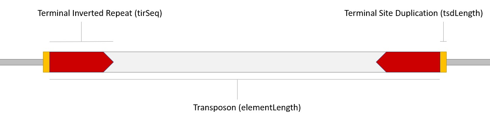

<!-- badges: start -->
[](https://travis-ci.org/jackgisby/packFinder)
<!-- badges: end -->


# packFinder
A package for the de novo discovery of pack-TYPE transposons. Transposons are detected in DNA sequences based on conserved terminal inverted repeat sequences and presence of terminal site duplications. packFinder allows users to search a given Genome for Pack-TYPE transposons with minimal input and setup.



## Quick Start
Users may download packFinder and use the primary function - packSearch - to locate potential transposons in a given Genome. The command line tool "VSEARCH" must be installed prior to use of clustering and alignment functions.

### R Package Dependencies
In addition to CRAN package dependencies, that will be installed automatically upon downloading packFinder, some dependencies must be downloaded from Bioconductor. 

```
if (!requireNamespace("BiocManager", quietly = TRUE)) {
    install.packages("BiocManager")
}

BiocManager::install("Biostrings")
BiocManager::install("GenomicRanges")
```

Then, packFinder may be installed.

```
#devtools must be installed to download packFinder from github
#install.packages("devtools")

devtools::install_github("jackgisby/packFinder")
library("packFinder")
```

### Command Line Dependencies
While the primary packFinder functions may now be used, VSEARCH must be installed for use of clustering and alignment functions. Detailed installation instructions are available from the README file on the VSEARCH github (https://github.com/torognes/vsearch). The command line can be used to install VSEARCH on Linux and MacOS operating systems (using wget and tar) while VSEARCH can be downloaded and extracted for use on Windows systems. For Linux and MacOS systems, correct installation of VSEARCH should allow users to use all functions within packFinder whereas for windows users, the absolute path to the VSEARCH executable file must be specified when calling packFinder clustering and alignment functions.

## Using packFinder
The packFinder vignette includes a full walkthrough of the package. To get started quickly, it is easiest to download a genome of interest using the biomartr package and follow the steps outlined in the vignette. 
